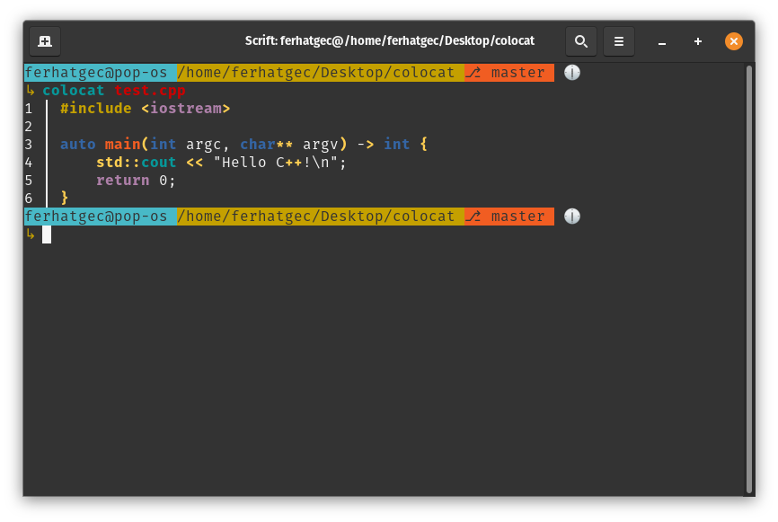

# Fegeya Colocat
## Fegeya Colocat, Colorized 'cat' implementation. Written in C++17.

### Language support:
  * [x] C++
  * [x] FlaScript
  * [x] Python
  * [x] HTML
  * [x] JavaScript
  * [ ] Golang
  * [ ] Vala

### Other implementations:
 * [For Rust as RustoCat](https://github.com/ferhatgec/rustocat)
 * [For FlaScript as FlaCat](https://github.com/ferhatgec/flacat)
 * [For Vala as ValaCat](https://github.com/ferhatgec/valacat)
 * [For FlaScript as Kitty](https://github.com/ferhatgec/kit)

### Fegeya Colocat licensed under the terms of MIT License.
